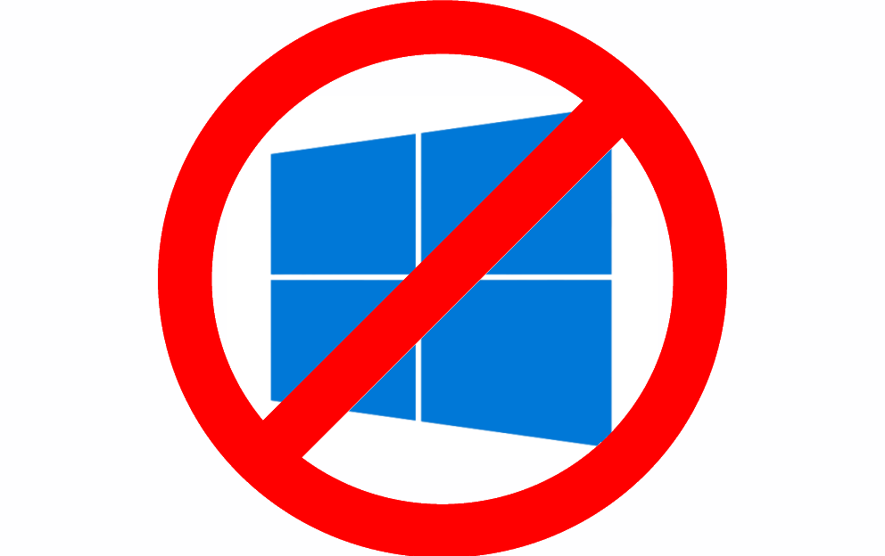

# Social Site

Sosyel

## Local Development Setup

### Sistem Operasi

Bila anda penggguna Windows, gunakan Ubuntu atau distro lain dengan WSL2. Selain itu, anda bisa menggunakan Linux distribusi apa pun atau Mac OS. Referensi instalasi WSL: https://learn.microsoft.com/en-us/windows/wsl/install

### Git

Authorize ke github menggunakan SSH/ HTTPs. Referensi untuk SSH:
https://docs.github.com/en/authentication/connecting-to-github-with-ssh/generating-a-new-ssh-key-and-adding-it-to-the-ssh-agent
https://docs.github.com/en/authentication/connecting-to-github-with-ssh/adding-a-new-ssh-key-to-your-github-account

### Requirements

1. Node versi 18
2. Yarn
3. Redis
4. Postgres

### Instalasi Requirements

1. Install node 18 melalui node version manager. Referensi: https://github.com/nvm-sh/nvm#installing-and-updating

`nvm install 18 --lts`

2. Install postgres, buat database baru (nama bebas). Referensi: https://learn.microsoft.com/en-us/windows/wsl/tutorials/wsl-database#install-postgresql
3. Install Redis. Referensi: https://redis.io/docs/getting-started/installation/install-redis-on-windows/

### Langkah-Langkah

1. Clone repo `git clone git@github.com:KATITB2023/social.git` atau `git clone https://github.com/KATITB2023/social.git`
2. Install Yarn `npm install --global yarn`
3. Jalankan `yarn install`
4. Copy file `.env.example` menjadi `.env`
5. Ubah nilai dari `DATABASE_URL` menjadi alamat database kalian
6. Hapus baris `NEXT_PUBLIC_WS_URL="ws://localhost:3000"`
7. Jalankan database migration. `yarn migrate-dev`
8. Jalankan local dev server. `yarn dev`